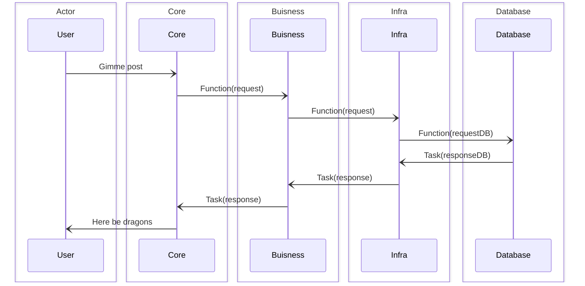
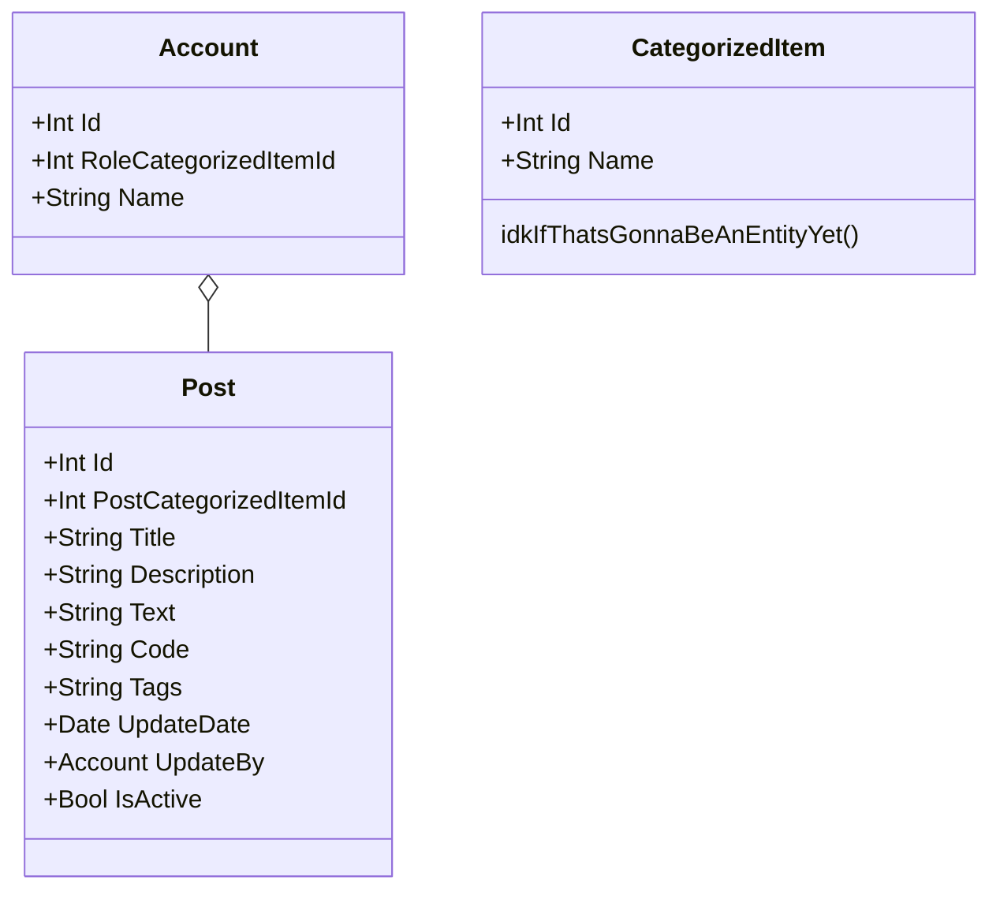

# Welcome to the World of Approachable Low-Level C# Programming!

Diving into the depths of low-level programming in C# might seem daunting at first glance. The mention of pointers, memory management, and unsafe code often sends even experienced developers running for the hills. But what if we told you that unlocking the power of low-level C# is not only achievable but can also be an exciting and rewarding journey? Welcome to a blog dedicated to transforming the seemingly formidable world of low-level C# into a playground of opportunities for optimization, efficiency, and performance.

## Making Low-Level C# Accessible

Our mission is simple: to demystify the complexities of low-level C# programming and show you that with the right guidance, these powerful concepts are within your grasp. Whether you're looking to optimize critical sections of your code, understand how your applications interact with hardware, or simply curious about what goes on under the hood of the C# language, you're in the right place.

# Development stuff

## API

    
Diagram

## Database Entities

    
Diagram

